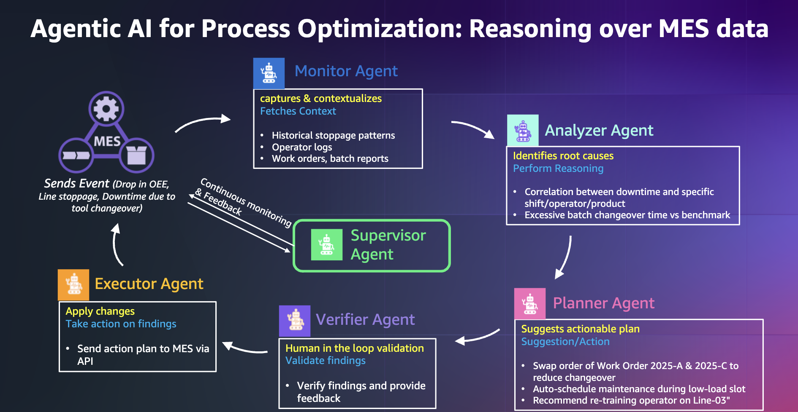

# MES Intelligent Agentic AI System

## Overview

This project implements an **Intelligent Agentic AI system for Autonomous Manufacturing Operations** using a sophisticated multi-agent architecture. The system provides comprehensive defect analysis and quality management for Manufacturing Execution Systems (MES) through coordinated AI agents.

## Benefits for End Users

### 🎯 **Immediate Value Delivery**
- **Rapid Root Cause Analysis**: Get comprehensive defect analysis in under 60 seconds instead of hours or days of manual investigation
- **Actionable Insights**: Receive specific, prioritized recommendations with clear implementation steps and resource requirements

### 📊 **Enhanced Decision Making**
- **Data-Driven Insights**: Make informed decisions based on statistical analysis and historical patterns rather than intuition
- **Executive Reporting**: Generate professional PDF reports with executive summaries for stakeholder communication and compliance documentation

### ⚡ **Operational Excellence**
- **Real-time Monitoring**: Continuous OEE tracking and automated alerts for critical performance deviations
- **Cross-functional Collaboration**: Shareable reports and notifications ensure all stakeholders stay informed and aligned on improvement initiatives

### 🔧 **Manufacturing Optimization**
- **Equipment Effectiveness**: Optimize Overall Equipment Effectiveness (OEE) through targeted downtime reduction and changeover improvements
- **Quality Enhancement**: Reduce defect rates and improve first-pass yield through systematic quality issue identification and resolution

## Architecture



### Multi-Agent System

The system employs a **Supervisor-Agent pattern** with five specialized agents working in sequence:

```
🔍 Supervisor Agent (Orchestrator)
    ↓
🔍 Monitor Agent → 🎯 Analyzer Agent → 📋 Planner Agent → ✅ Verifier Agent → ⚡ Executor Agent
```

#### Agent Responsibilities

1. **🔍 Monitor Agent (Context Builder)**
   - Captures OEE drops and performance metrics
   - Fetches historical patterns and operational context
   - Retrieves operator logs and work order analysis
   - Monitors downtime events and line stoppages

2. **🎯 Analyzer Agent**
   - Performs root cause identification
   - Conducts correlation analysis between downtime factors
   - Provides statistical confidence and impact quantification
   - Analyzes batch changeover times vs benchmarks

3. **📋 Planner Agent**
   - Creates actionable improvement plans
   - Generates comprehensive PDF reports
   - Provides resource estimation and implementation roadmaps
   - Defines success metrics and KPIs

4. **✅ Verifier Agent**
   - Validates analysis findings with human-in-the-loop process
   - Performs quality assurance on recommendations
   - Manages alert escalation for critical issues

5. **⚡ Executor Agent**
   - Sends email notifications with detailed reports
   - Executes immediate action items
   - Coordinates with manufacturing departments
   - Integrates with MES APIs for action execution

6. **🔍 Supervisor Agent**
   - Orchestrates the complete workflow
   - Ensures proper data flow between agents
   - Manages analysis scope and parameters
   - Compiles comprehensive results

## Features

### Core Capabilities

- **🎯 Defect Analysis**: Comprehensive analysis of manufacturing defects with configurable scope
- **📊 OEE Monitoring**: Real-time Overall Equipment Effectiveness tracking
- **⏱️ Downtime Analysis**: Root cause analysis of production stoppages
- **🔄 Changeover Optimization**: Batch changeover time analysis vs benchmarks
- **🔧 Maintenance Correlation**: Predictive maintenance insights
- **📄 PDF Reporting**: Automated generation of detailed analysis reports
- **📧 Email Notifications**: Automated stakeholder notifications with PDF links
- **🔗 Shareable Reports**: URL-based PDF sharing for team collaboration

### Analysis Scope Configuration

Users can configure analysis scope with the following options:
- ✅ OEE Performance Analysis
- ✅ Downtime & Stoppages Analysis
- ✅ Batch Changeover Analysis
- ✅ Maintenance Correlation Analysis

### Interactive UI

- **Streamlit-based UI** with real-time monitoring
- **Defect type selection** with preview information
- **Configurable time periods** (3, 7, 14, 30 days)
- **PDF report viewer** with sharing capabilities
- **Executive summary** with key findings and recommendations


### AI/ML Framework
- **Strands Framework** - Multi-agent orchestration
- **Amazon Bedrock** - Claude Sonnet 4 LLM integration
- **Boto3** - AWS services integration


### Setup

1. **Environment Setup**


   Create and activate a Python virtual environment:

   ```bash
   python3 -m venv .venv
   source .venv/bin/activate  # On Windows: .venv\Scripts\activate
   ```

2. **AWS Configuration**

   Configure AWS environment variables by creating a `.env` file:

   ```text
   AWS_REGION="YourRegion" #example us-east-1
   AWS_PROFILE="myprofile" #from ~/.aws/config
   ```

3. **Install Required Packages**

   ```bash
   pip install -r requirements.txt
   ```

4. **Generate the Sample MES Database**

   ```bash
   # Clone the repository
   git clone https://github.com/aws-samples/industrial-data-store-simulation-chatbot.git

   # Navigate to the data generator directory
   cd industrial-data-store-simulation-chatbot/app_factory/data_generator

   # Create tables and simulation data (auto-detects if database exists)
   python3 sqlite-synthetic-mes-data.py --config data_pools.json --lookback 90 --lookahead 14
   ```

   This will create the database file `mes.db` in the project root directory if it doesn't exist, or refresh the data if it does.

5. **SetEnvironment Variables**

   Configure environment variables by editing `mes_config.sh` file then run:


   ```bash
   source mes_config.sh
   ```

## Running the Applications

You can run the applications independently or together:

### Run All Components Together

```bash
# Start the combined application
python3 -m streamlit run app.py
```


## Database Schema

The system works with the following key tables:
- `OEEMetrics` - Equipment effectiveness data
- `Downtimes` - Production stoppage events
- `WorkOrders` - Manufacturing orders and batches
- `QualityControl` - Quality inspection data
- `Defects` - Defect occurrence records
- `Machines` - Equipment information
- `Employees` - Operator data
- `Products` - Product specifications

## Usage

### Running Defect Analysis

1. **Select Defect Type**: Choose from available defect types in the sidebar
2. **Configure Scope**: Enable/disable analysis areas based on requirements
3. **Set Time Period**: Select lookback period (3-30 days)
4. **Execute Analysis**: The supervisor agent orchestrates the complete workflow
5. **Review Results**: Examine findings, action plans, and generated reports
6. **Share Reports**: Use generated PDF links for stakeholder collaboration

### Workflow Execution

The system automatically executes the following workflow:

1. **Monitor Phase**: Captures operational data and context
2. **Analysis Phase**: Performs root cause analysis with statistical confidence
3. **Planning Phase**: Creates actionable improvement plans and PDF reports
4. **Verification Phase**: Validates findings and determines escalation needs
5. **Execution Phase**: Sends notifications and executes immediate actions

## Configuration

### AWS Configuration
- Configure Bedrock model: `global.anthropic.claude-sonnet-4-20250514-v1:0`
- Set up SES for email notifications
- Configure IAM roles for service access

### Database Configuration
- Default database path: `./mes.db`
- Configurable via `MESAgentManager` initialization

### Report Configuration
- PDF reports saved to `./reports/` directory
- Shareable URLs generated for team collaboration
- CloudFront integration for scalable distribution


## Transform responsible AI from theory into practice
- The rapid growth of generative AI brings promising new innovation, and at the same time raises new challenges. Please refer  https://aws.amazon.com/ai/responsible-ai/ 
- Implement safeguards customized to your application requirements and responsible AI policies. Please refer Amazon Bedrock Guardrails here: 
 https://aws.amazon.com/bedrock/guardrails/

## Disclaimer

**Important Notice**: This MES Intelligent Agentic AI System is provided for demonstration purposes. Please review the following disclaimers before implementation:

### Production Use
- This system is designed as a proof-of-concept and may require additional testing and validation before production deployment
- Manufacturing decisions should not be made solely based on AI recommendations without human oversight and validation
- Always consult with qualified manufacturing engineers and domain experts before implementing suggested changes

### Data and Privacy
- Ensure compliance with your organization's data governance and privacy policies
- Review all data handling practices with your security team before processing sensitive manufacturing data

### AI Model Limitations
- Continuous monitoring and human oversight are essential for optimal system performance

### Liability
- The authors and contributors are not liable for any manufacturing disruptions, quality issues, or financial losses
- This sample is provided "as-is" without warranties of any kind

## FAQ

### General Questions

**Q: What manufacturing industries can benefit from this system?**
A: The system is designed for discrete manufacturing industries including automotive, electronics, pharmaceuticals, food & beverage. It can be adapted for process manufacturing with configuration changes.

**Q: Can I use a different database instead of SQLite?**
A: Currently, the system is optimized for SQLite. You can modify the database layer for custom implementations.

**Q: Can this integrate with our existing MES system?**
A: The system is designed to work alongside existing MES systems by reading data from standard database formats. Direct API integration depends on your MES vendor and may require custom development.

**Q: How do I connect to our real manufacturing data?**
A: Replace the synthetic data generator with connections to your actual MES database. Modify the database connection settings to point to your production data source.

### Troubleshooting Questions

**Q: The analysis is taking too long. How can I optimize performance?**
A: 
- Reduce the analysis time period (use 3-7 days instead of 30)
- Disable unnecessary analysis scopes
- Ensure adequate system resources
- Check AWS Bedrock service limits and quotas

# Credits

This project's data_generator is inspired by [https://github.com/aws-samples/industrial-data-store-simulation-chatbot) sample.

# License

This library is licensed under the MIT-0 License. See the LICENSE file.


**Built with ❤️ for Manufacturing Excellence**
